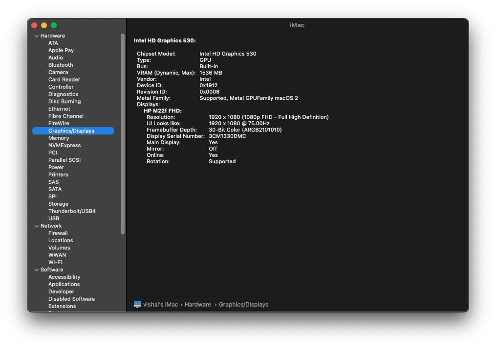

# Hackintoshing Dell OptiPlex 5050 Micro


[](https://www.pcmag.com/reviews/dell-optiplex-5050-micro)
[](LICENSE)
[](https://github.com/Vishal-09-00/Dell-OptiPlex-5050-Hackintosh)

## Introduction

This repository contains information for getting macOS Monterey working on a **Dell OptiPlex 5050 Micro** PC.

This is intended to create a "fully" functional (as far as possible) hackintosh for the Dell OptiPlex 5050 Micro.

The process of installing macOS onto a PC is termed as Hackintoshing. Note that Hackintosh **is not** the OS, it can also refer to the machine that was "hacked" to get macOS running on it. Example: I installed macOS on this Windows machine, therefore I have a Hackintosh. But I did NOT install "Hackintosh".

If you would like to get started with creating a hackintosh for your system but have no prior experience in this regard, I would highly recommend following [**Dortania's OpenCore Install guide**](https://dortania.github.io/OpenCore-Install-Guide/).
With every new release of macOS, we need to resolve each new "minor issue" we run into. The installation is not perfect yet since it's a continuos work-in-progress, but I'm glad that **I have learned a lot** in the meantime. All of the steps I made to get to this point were a result of countless hours of reading along with trial and error. I am by no means an expert, so any help to get this project further enchanced is highly appreciated!

For privacy reasons, all SMBIOS information has been wiped out in the configuration file `EFI/OC/config.plist`. [Generate your own SMBIOS Information](#Generate-your-own-SMBIOS-Information).

This repository is for **educational and informational purposes only**.

## Table of Contents

- [Hackintoshing Dell OptiPlex 5050 Micro](#hackintoshing-dell-optiplex-5050-micro)
  - [Introduction](#introduction)
  - [Table of Contents](#table-of-contents)
  - [Danger](#danger)
  - [System Specifications](#system-specifications)
  - [Current Status](#current-status)
  - [DELL Specific BIOS Settings](#dell-specific-bios-settings)
  - [Generate USB Mapping using USBToolBox](#generate-usb-mapping-using-usbtoolbox)
  - [Generate System specific SSDTs using SSDTTime](#generate-system-specific-ssdts-using-ssdttime)
  - [Graphic Acceleration or NVRAM Fix](#graphic-acceleration-or-nvram-fix)
  - [Generate your own SMBIOS Information](#generate-your-own-smbios-information)
  - [Validate Configuration](#validate-configuration)
  - [End Result](#end-result)
  - [Credits](#credits)
  - [HELP](#help)

## Danger

- Patience & trial and error are the key to success.
- Don't start working on this, if you have deadlines or important work. 
- Hackintoshes are not something you should be relying on as a work machine.
- If you are naive, stick to the DEBUG version of all the required files in order to rectify the issues using the log files, which will arise upon booting. After successful installation, this can be changed to [Release version](https://dortania.github.io/OpenCore-Post-Install/cosmetic/verbose.html#macos-decluttering).
- Kexts will look like normal folders in your OS (Windows and Linux), double check that the folder you are installing has a .kext extension visible(and do not add one manually if it's missing).
- SSDTs and custom DSDTs(.aml) go into the ACPI folder.
- Kexts(.kext) go into the Kexts folder.
- Firmware drivers(.efi) go into the Drivers folder.

## System Specifications

| Specification | Details                                                                                                                                                               |
| -------------- | -------------------------------------------------------------------------------------------------------------------------------------------------------------------- |
| Computer Model | Dell OptiPlex 5050 Micro SFF                                                                                                                   |
| Operating System| Windows 10 Pro Version 22H2                                                                                                                   |
| Processor      | Intel(R) Core(TM) [i5-6500](https://www.intel.in/content/www/in/en/products/sku/88184/intel-core-i56500-processor-6m-cache-up-to-3-60-ghz/specifications.html) CPU @ 3.20GHz (Skylake) |
| Memory         | 12GB DDR4 @2133MHz                                                                                                                                        |
| Hard Disk      | TOSHIBA MQ01ABF050 500GB @ 7200RPM                                                                                                                                          |
| Graphics       | Intel(R) HD Graphics 530, Device ID: 0x1912, PCI Path: PciRoot(0x0)/Pci(0x2,0x0)                                                                                                                            |
| Monitor        | HP M22f FHD 1920x1080 (21.5-inches), Refresh Rate 75Hz, HDMI 1.4 Port                                                                                                                          |
| Sound Codec     | Realtek ALC255                                                                                                                                                       |
| NIC Card  | Intel® Dual-Band Wireless-AC 8265 Wi-Fi + BT 4.2 Wireless Card, Intel® i219-V (Ethernet)                                                                                                                                                   |
| Input       | [Logitech M221 Wireless Mouse](https://www.amazon.in/Logitech-Silent-Wireless-Mouse-Charcoal/dp/B01M72LILF/ref=sr_1_3?crid=QOJ1304Z45XQ&keywords=logitech%2Bmouse&qid=1679825028&sprefix=logitech%2Bmous%2Caps%2C294&sr=8-3&th=1), [Logitech MK220 Wireless Keyboard](https://www.amazon.in/Logitech-MK220-Wireless-Keyboard-Mouse/dp/B008QS7JN4/ref=sr_1_3?crid=3G96S1SHCJ10V&keywords=k220&qid=1679825117&sprefix=k220%2Caps%2C219&sr=8-3)                                                                                                                                                         |
## Current Status

| Components     | Monterey 12.6.3    |
| ----------------- |--------------------|
| Logitech Mouse    |        ✅         |
| Logitech Keyboard |        ✅         | 
| Audio             |        ✅         |         
| Microphone        |        🤷‍♂️         |         
| Wifi              |        ✅         |        
| Bluetooth         |        ✅         |          
| Sleep/Wake        |        ❌         |          
| Power Management  |        🤷‍♂️         |          
| Graphic Acc.      |        🟢         |          
| Hibernation       |        ❌         |
| Mouse Cursor      |        🟡         |   

```md
✅  : Working out of the box.

🟢  : Some additional steps required to make it work.

🟡  : Working but not perfectly i.e buggy sometimes.

❌  : Currently not working.

🤷‍♂️  : Haven't tested properly yet.
```

<details>
<summary>What's wrong:</summary>

❌ [ ] **Sleep** not working.
  - If you are able to solve this issue, it will be highly appreciated.

❌ [ ] **Dual Boot** not tested yet.
  - I have not tried to dual boot with Windows/Linux yet. You can follow this [guide](https://dortania.github.io/OpenCore-Multiboot/Intro/Def.html#what-is-multibooting) for the same.

</details>

## DELL Specific BIOS Settings

- Boot List Option ⏩ UEFI
- Compatibility Support Module(CSM) aka Legacy Option ROMs ⏩ Disabled
- SATA Operation ⏩ AHCI
- Primary Display ⏩ Intel HD Graphics
- TPM 1.2 Security ⏩ On & Enabled
- CPU XD Support ⏩ Enable
- SMM Security Mitigation ⏩ Enable
- Secure Boot Enable ⏩ Disabled
- Intel SGX Enable ⏩ Disabled
- POST Behavior>Fastboot ⏩ Thorough
- Virtualization>Enable Intel Virtualization Technology ⏩ Enabled
- Virtualization>Enable Intel VT for Direct I/O aka **VT-d** ⏩ Enabled
- Virtualization>Trusted Execution ⏩ Enabled

**Note:** There is no option in DELL BIOS to set DVMT Pre-Allocated(iGPU Memory) to 64MB or higher, in this regard we are using the [framebuffer patching](https://dortania.github.io/OpenCore-Install-Guide/config.plist/skylake.html#add-2) guide.

**Note:** The CFG Lock is enabled in DELL Firmware but we are not provided with the option to disable it, in order to bypass this issue, set `AppleXcpmCfgLock` to `True`.

**Note:** Since I have enabled VT-d in the BIOS, I have to set `DisableIoMapper` to `True`.

**Note:** Since I am installing macOS 12 (Monterey) , I have to set `XhciPortLimit` to `False`.

**Note:** The `alcid` boot-arg under `NVRAM`>`7C436110-AB2A-4BBB-A880-FE41995C9F82` needs to be tested according to your system. Here for my system, I have used `alcid=11`, which enabled my front panel audio jack to work properly prior to which I noticed audio disturbance using `alcid=3`.

## Generate USB Mapping using USBToolBox

The USBToolBox tool is a USB mapping tool supporting Windows and macOS. It allows for building a custom injector kext from Windows and macOS.

Grab a copy of tool from github [repository](https://github.com/USBToolBox/tool) and generate your UTBMap.kext by plugging in a USB device into each port and wait for the listing to show your USB device before unplugging it and plugging it into another port.

**Note**: 

[1] Try to limit the total usable ports to 15 in number because of the 15 port limit in macOS which is a strict limit of only 15 possible ports per controller.

[2] **Do not** include the UTBDefault.kext in the Kext folder after USB mapping using USBToolBox.

[3] **Include** USBToolBox.kext from the github [repository](https://github.com/USBToolBox/kext) into your Kext folder.

## Generate System specific SSDTs using SSDTTime

DSDTs and SSDTs are tables present in your firmware that outline hardware devices like USB controllers, CPU threads, embedded controllers, system clocks and such. A DSDT(Differentiated System Description Table) can be seen as the body holding most of the info with smaller bits of info being passed by the SSDT(Secondary System Description Table). You can think of the DSDT as the building blueprints with SSDTs being sticky notes outlining extra details to the project.

Grab a copy of tool from corpnewt's github [repository](https://github.com/corpnewt/SSDTTime) and generate your SSDTs according to the requirements.

**Note**: 

[1] **Not** all SSDTs are required to be generated, only generate those that are listed alongside your CPU codename in the [opencore guide](https://dortania.github.io/Getting-Started-With-ACPI/ssdt-platform.html#what-ssdts-do-each-platform-need).

[2] **Do not** include the DSDT.aml in the ACPI folder since those are already present inside your firmware.

[3] **Do not** include the .dsl files generated in the ACPI folder since those are not the compiled version.

[4] You will need to create SSDT-USBX.aml and SSDT-EC.aml separately using the tool.

[5] **Don't** forget to patch the patches_OC.plist with your config.plist using the PatchMerge.bat script, present inside the /SSDTTime-master/ folder.

## Graphic Acceleration or NVRAM Fix

The major obstacle along this journey of Hackintoshing was related to Graphic Acceleration limited to 7MB of VRAM using the Intel HD 530.


With immense help from **Obi Cobobi** aka **CorpNewt#4290** from [Discord](https://discord.gg/u8V7N5C), the problem was narrowed down to framebuffer patching by setting the connector types of the 2 valid connectors from 0x00040000 (Display Port) to 0x00080000 (HDMI).

This needs to be done under:

DeviceProperties>Add>PciRoot(0x0)/Pci(0x2,0x0)>framebuffer-con1-enable

DeviceProperties>Add>PciRoot(0x0)/Pci(0x2,0x0)>framebuffer-con1-type

DeviceProperties>Add>PciRoot(0x0)/Pci(0x2,0x0)>framebuffer-fbmem

DeviceProperties>Add>PciRoot(0x0)/Pci(0x2,0x0)>framebuffer-patch-enable

DeviceProperties>Add>PciRoot(0x0)/Pci(0x2,0x0)>framebuffer-stolenmem

Here conX, where X can be any value according to your system needs to be set accordingly, for my Dell OptiPlex 5050 Micro the value of X is 1 (con1).The value of X can be found out using [IOReg](https://github.com/khronokernel/IORegistryClone/blob/master/ioreg-302.zip) by **corpnewt** in macOS only.

The detailed guide to achieving this can be found [here](https://dortania.github.io/OpenCore-Post-Install/gpu-patching/intel-patching/connector.html#patching-connector-types).

We also need to add **igfxonln=1** in the [boot arg](https://dortania.github.io/OpenCore-Install-Guide/config.plist/skylake.html#add-4), which will force all iGPU connectors online at boot.



## Generate your own SMBIOS Information

For privacy reasons, all SMBIOS information has been wiped out in the configuration file `EFI/OC/config.plist`. You need to generate your unique `SMBIOS` info by yourself.


Use corpnewt's **[GenSMBIOS](https://github.com/corpnewt/GenSMBIOS)** script to generate the SMBIOS information and inject them into your `config.plist` in the highlighted area in image.

## Validate Configuration

Validate the final config.plist using OCValidate Tool present inside OpenCore's Utilties/ocvalidate/ folder.

Open a command prompt inside the folder (Utilties/ocvalidate/) and type:
```shell
ocvalidate.exe <path to config.plist>
```
This script will check through the entire configuration for any possible missing/incorrect values.

## End Result


## Credits

- Special Thanks to **[Obi Cobobi aka CorpNewt#4290](https://github.com/corpnewt)** for providing all the scripts and valuable help.
- Special Thanks to **[Utkarsh Sharma](https://github.com/uttusharma)** for providing the motivation.
- Thanks to **Prebuilt-Killa aka KrazyKilla#1475** for solving IRQ conflicts.
- Thanks to **ruddnicholse#6069** for bypassing the device-id using false value.
- Thanks to **hkusdaryanto#8463** and **OotinnyoO#6384** for suggesting OCValidate against config.plist.
- Thanks to [Acidanthera](https://github.com/acidanthera) for providing [AppleALC](https://github.com/acidanthera/AppleALC), [AppleSupportPkg](https://github.com/acidanthera/AppleSupportPkg), [Lilu](https://github.com/acidanthera/Lilu), [OpenCorePkg](https://github.com/acidanthera/OpenCorePkg), [VirtualSMC](https://github.com/acidanthera/VirtualSMC), [WhateverGreen](https://github.com/acidanthera/WhateverGreen) and [IntelMausi](https://github.com/acidanthera/IntelMausi).
- Thanks to [OpenIntelWireless](https://github.com/OpenIntelWireless/itlwm/releases), [IntelBluetoothFirmware](https://github.com/acidanthera/BrcmPatchRAM/releases).

## HELP

For any query related to this setup, feel free to join the conversation in [Discord](https://discord.gg/u8V7N5C) or [Reddit](https://www.reddit.com/r/hackintosh/).
